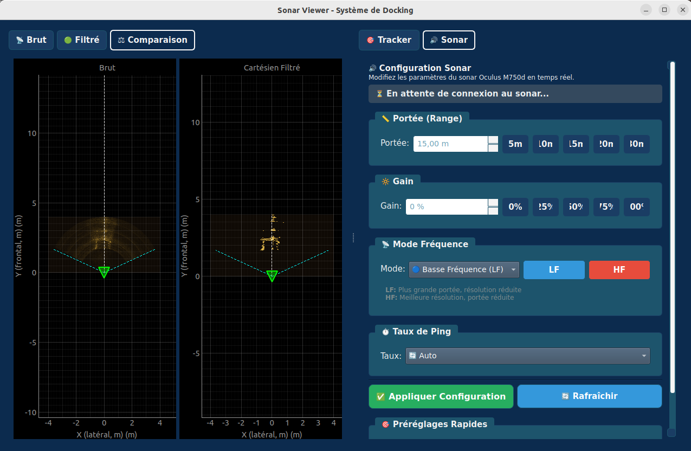

# Affichage Package

Interface graphique PyQt5 pour visualiser les données sonar et contrôler le tracking.

## Description

- **`sonar_viewer`** : Application GUI temps réel affichant les images sonar (brutes et cartésiennes), les lignes détectées, la bbox trackée et la pose de la cage.

## Topics

| Topic | Type | Direction | Description |
|-------|------|-----------|-------------|
| `/docking/sonar/raw` | `Frame` | Subscription | Image sonar brute (polaire) |
| `/docking/sonar/cartesian_filtered` | `FrameCartesian` | Subscription | Image sonar cartésienne filtrée |
| `/docking/tracking/detected_lines` | `DetectedLines` | Subscription | Lignes détectées (Hough) |
| `/docking/tracking/tracked_object` | `TrackedObject` | Subscription | Position trackée (CSRT) |
| `/docking/tracking/cage_pose` | `PoseStamped` | Subscription | Pose de la cage |
| `/docking/sonar/bbox_selection` | `BBoxSelection` | Publication | Bbox sélectionnée par l'utilisateur |
| `/docking/tracking/trigger_auto_detect` | `Bool` | Publication | Déclenche la recherche auto |

## Fonctionnalités

- **Vues** : Brut, Cartésien filtré, Comparaison côte à côte
- **Sélection bbox** : Clic + drag pour dessiner une zone à tracker
- **Contrôles tracker** : Boutons pour CSRT manuel et auto-tracking
- **Configuration sonar** : Réglage portée, gain, mode en temps réel
