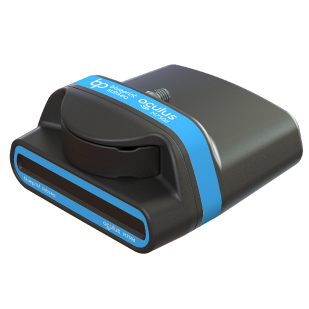
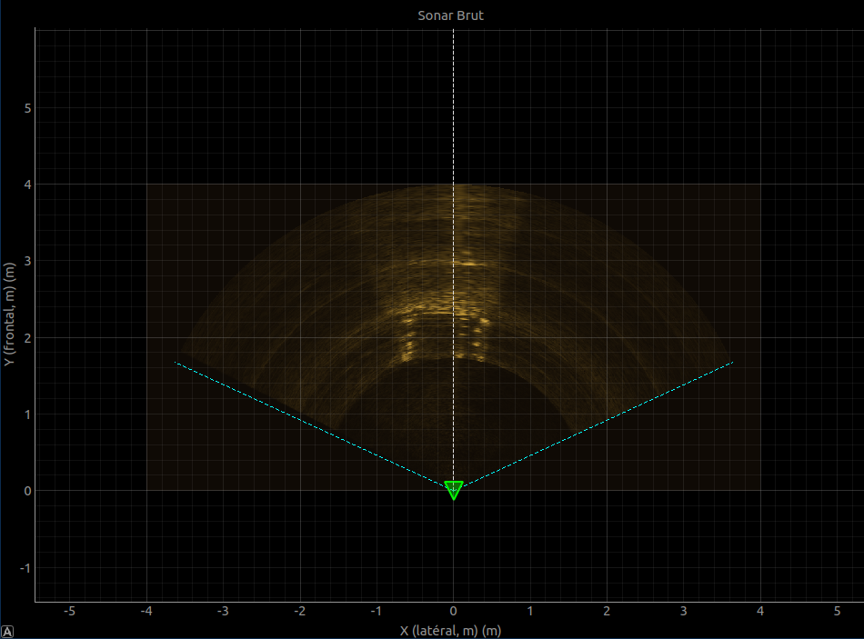
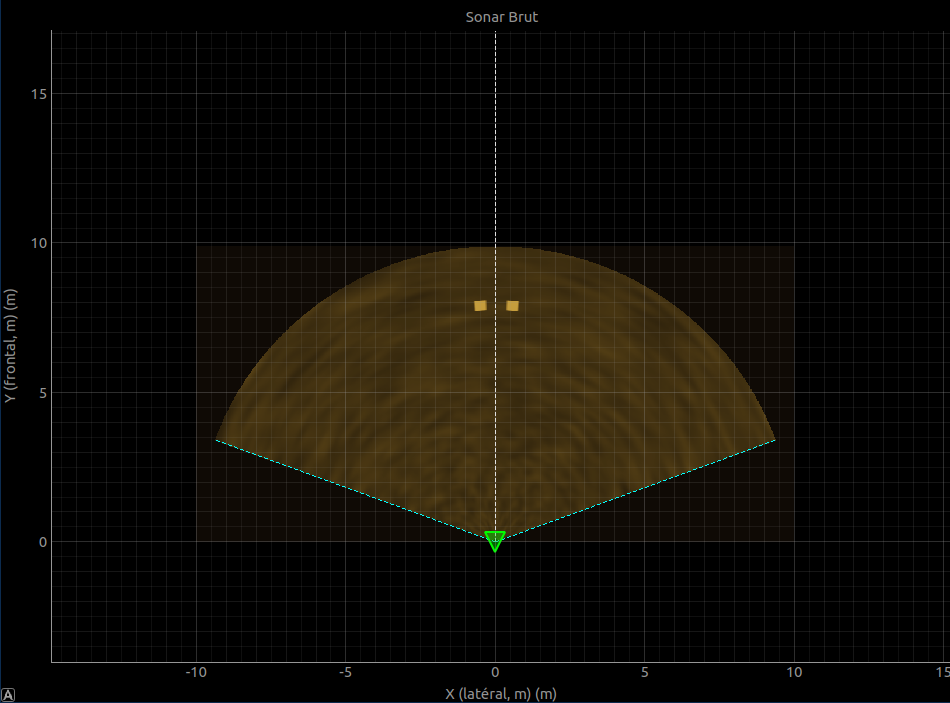

# Sonar Package

Package ROS2 pour l'acquisition et la simulation de données sonar Oculus M750d, utilisé pour la détection de cage lors des opérations de docking.



## Description

- **`sonar_node`** : Driver pour le sonar Oculus M750d réel. Interface avec le SDK [oculus_python](https://github.com/ENSTABretagneRobotics/oculus_driver/tree/v1.2.1/python) et publie les frames brutes.



- **`sonar_mock`** : Simulateur de sonar pour développement sans matériel et sans rosbag. Génère des frames synthétiques avec une cage virtuelle réagissant aux commandes de vitesse. On conseille fortement d'utiliser des rosbag pour les tests de la pipeline de traitement, mais ce module peut être utile si aucun rosbag n'a été enregistré.


## Topics publiés

| Topic | Type | Nœud(s) | Description |
|-------|------|---------|-------------|
| `/docking/sonar/raw` | `docking_msgs/Frame` | Les deux | Frame sonar (image polaire bearing×range) |

**Structure du message `Frame` :**
```
header:
  stamp: <timestamp>
  frame_id: "sonar_link"
range_count: 512           # Nombre de bins en distance
bearing_count: 256         # Nombre de bins en azimut  
range_resolution: 0.076    # Résolution distance (m/bin)
bearing_resolution: 0.0095 # Résolution azimut (rad/bin)
min_range: 1.0             # Portée minimale (m)
max_range: 40.0            # Portée maximale (m)
intensities: [...]         # Tableau 1D aplati (bearing-major)
sound_speed: 1500.0        # Vitesse du son (m/s)
gain: 50                   # Gain sonar (%)
```

## Détails techniques

> Pour plus d'explications, voir directement les commentaires dans le code source.

### Mock (`sonar_mock`)

- Déclaration des paramètres ROS2 (géométrie sonar, cage, bruit, filtres)
- Pré-calcul des grilles polaires (ranges, bearings) au démarrage
- Initialisation de l'état simulation (position cage relative au ROV)
- Timer physique à 50 Hz pour mise à jour cinématique
- Timer de publication à fréquence configurable
- **Callback `/cmd_vel`** : réception des commandes de vitesse
- **`update_physics()`** : applique la cinématique inverse (cage fixe, ROV mobile)
- **`generate_synthetic_frame()`** : génère bruit de fond réaliste
- **`publish_frame()`** : applique filtres → ajoute poteaux → publie `Frame`
- **`add_posts()`** : dessine les poteaux de cage aux positions calculées

### Réel (`sonar_node`)

- Déclaration des paramètres ROS2 (connexion, configuration sonar, masquage)
- Initialisation de la connexion SDK Oculus (`oculus_python`)
- Enregistrement des callbacks asynchrones du SDK
- **`_message_callback()`** : envoi de la configuration initiale au premier message
- **`_ping_callback()`** : extraction des données ping et stockage thread-safe
- **`_publish_frame()`** : transformation T1 (transpose) + masquage bords → publie `Frame`
- **`_configure_sonar_callback()`** : service de reconfiguration dynamique
- Nettoyage propre des ressources à l'arrêt du nœud


## Debugging
- Vérifiez la connexion réseau et les paramètres IP du sonar
- Assurez-vous que le SDK `oculus_python` est installé et accessible
- Utilisez `ros2 topic echo /docking/sonar/raw` pour vérifier les données publiées ou le package `affichage` pour visualiser les frames. 
- Activez les logs de débogage dans les paramètres ROS2 pour plus de détails (décommentez la ligne 123 dans `sonar_node.py` pour les callbacks de statut)